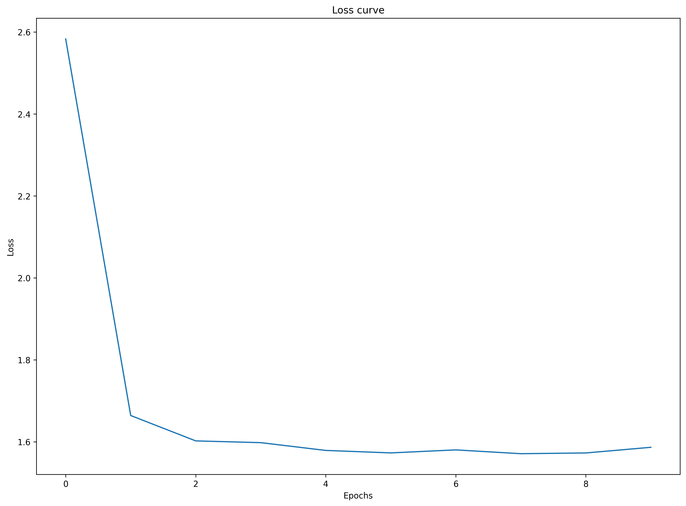
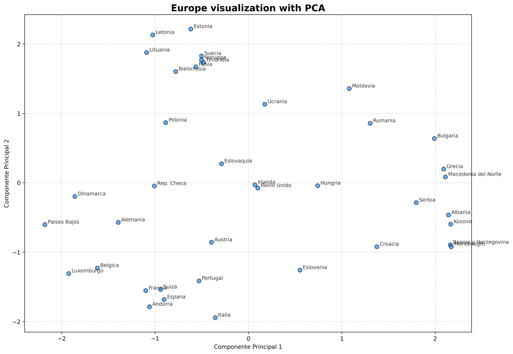
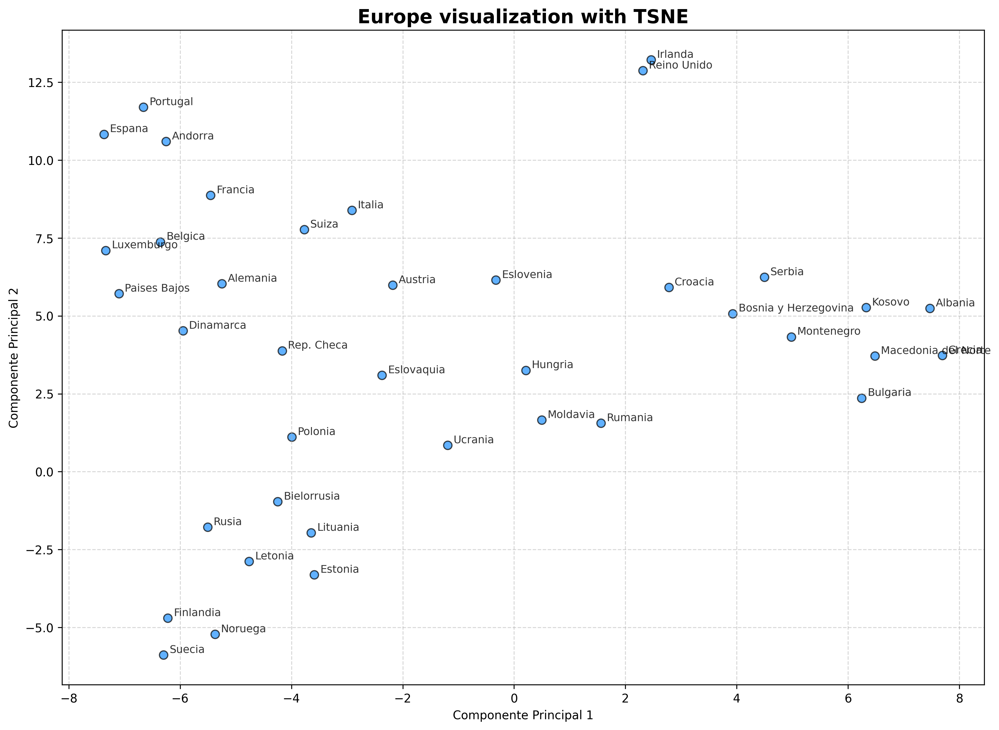

This is an implementation of the node2vec algorithm programmed from scratch using C++ and no external libraries, as well as the graph implementation. It is fast and optimized using subsampling and Negative-sampling. We have used the pybind11 library to transform the code for python usage.

## Installation and Build

This project uses `uv` for Python environment and dependency management, along with `CMake` to compile the native C++ library and the Python binding module using `pybind11`.

### 1. Prerequisites

* `uv` (you can any other python env)
* `cmake`
* A C++17 compatible C++ compiler

### 2. Clone the repository and install dependencies

Running the following commands allows `uv` to read the project configuration files, automatically create the virtual environment, and install the required libraries.

```bash
git clone https://github.com/ku2a/node2vec
cd node2vec
uv sync
sudo apt update
sudo apt install python3-dev                                            
```

### 3. Create the build directory

The binaries directory is intentionally excluded from version control.

```bash
mkdir build
cd build

```

### 4. Configure and compile

This ensures CMake uses the Python interpreter from the newly created virtual environment to locate the `pybind11` headers.

```bash
uv run cmake -DPython_EXECUTABLE=$(uv run which python) ..
uv run cmake --build .

```

Once finished, the compiled Python file will automatically move to the `python/` folder, and the native C++ executable will remain inside `build/`.

### 5. Run the project

To run the Python version:

```bash
cd ..
uv run python python/main.py

```

To run the native C++ version:

```bash
cd ..
./build/main_cpp

```

---


## Examples

We used as a simple example a graph with the european countries.

### Training Loss
This is a fairly simple graph, requiring very few epochs.



### 2D Projections of European Countries
To evaluate how well the algorithm captures the topological and structural relationships of the graph, we reduced the dimensionality of the learned embeddings to 2D. Countries that share similar structural contexts in the graph appear clustered together. 

**PCA Projection:**


**t-SNE Projection:**
